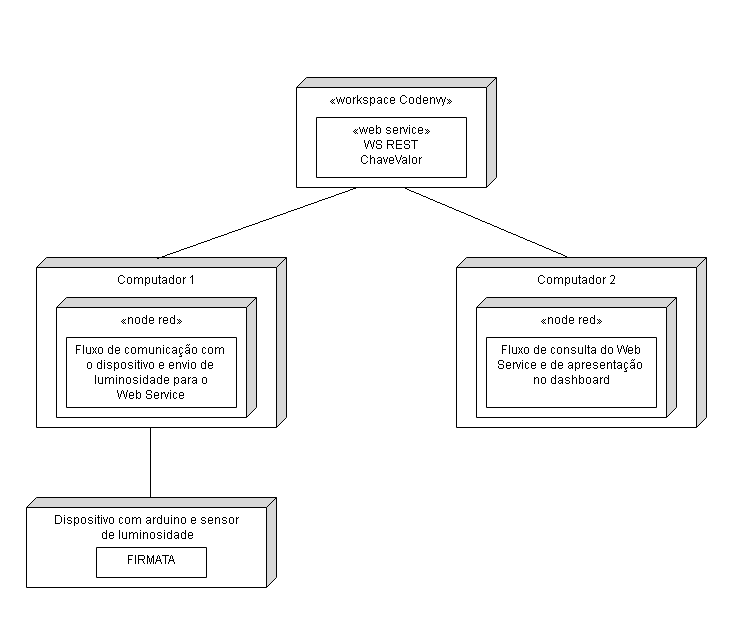

# LÂMPADA SENSORIAL

## Através de um sensor, o Arduino captará a luminosidade do ambiente e, dependendo da claridade, enviará uma mensagem para uma página html, solicitando o ligamento ou desligamento da lâmpada. A página html, além de “receBer” a mensagem de solicitação, também terá dois botões para ligar e desligar.

Se o usuário esquecer alguma luz da casa acesa, através do arduino, ela poderá desliga-la mesmo estando longe.

## Diagrama de implantação

## Montagem do dispositivo

Faça um diagrama de montagem do dispositivo. Exemplo:

